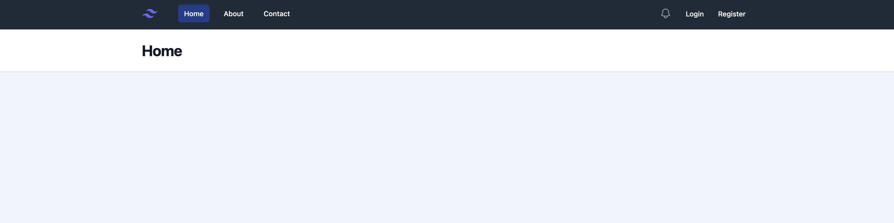
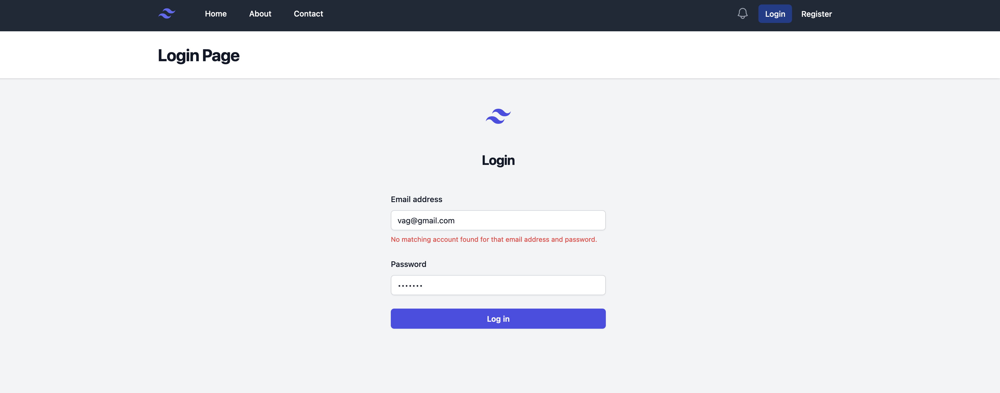
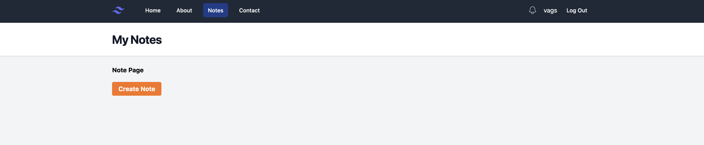
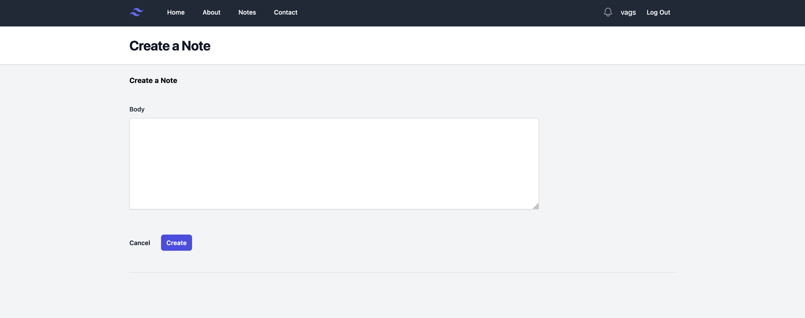

# Note Project
## Project Overview

The Note Project is a PHP-based web application following the MVC pattern and utilizing Object-Oriented Programming (OOP) principles. It includes a secure login and register system, allowing users to manage their notes. The project implements features such as creating, deleting, and viewing notes. Autoloading and Composer are integrated into the project for efficient dependency management.

## Features

  - MVC pattern for a structured and maintainable codebase.
  - Secure login and register system for user authentication.
  - CRUD functionality for managing notes (Create, Read, Update, Delete).
  - Autoloading and Composer for efficient dependency management.
  - Pest test for ensuring code reliability.

Before you begin, ensure you have the following installed

-  Web server (e.g., Apache, Nginx)
-  PHP (version 7 or higher)

Installation

    git clone https://github.com/your-username/note-project.git

Navigate to the project directory

    cd note-project

Run Pest tests:

    ./vendor/bin/pest
    
## Screenshots

    

    

    

Usage

## Accessing the Project:

  - Navigate to the project using your web browser.

  - User Actions:
      - Register for an account to create a user profile.
      - Log in using your credentials.
      - Create, view, update, and delete notes.

## Customization

  - Feel free to download the project and make any amendments based on your requirements.

## License

  - This project is licensed under the [MIT License](LICENSE).

